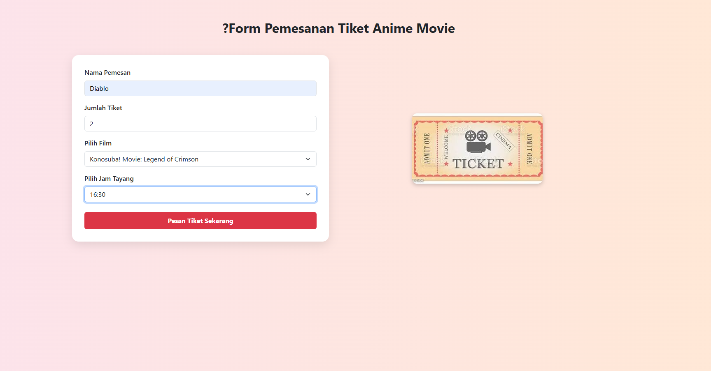
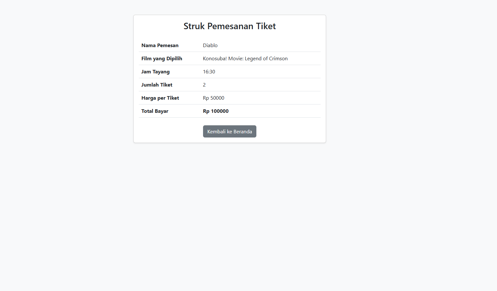

📝 UTS - Aplikasi Pemesanan Tiket Bioskop Anime (JSP)

 📚 Mata Kuliah

Pemrograman Java Lanjut
STMIK Mardira Indonesia
Semester Genap TA. 2024/2025
Dosen: Faiz Faisal Hafidz

🧾 Deskripsi Project

Aplikasi ini adalah sistem pemesanan tiket bioskop berbasis **Java JSP tanpa database**.
User dapat melihat daftar film (anime movie), memilih film, memilih jam tayang, dan memesan tiket.
Transaksi akan ditampilkan dalam bentuk struk sederhana.

🛠️ Fitur Utama

1. Halaman `index.jsp`

   * Menampilkan daftar film anime movie
   * Informasi: Judul, Genre, Durasi (menit), Harga Tiket, Jam Tayang, dan Poster
   * Disimpan dalam ArrayList di JSP

2. Halaman `formPesan.jsp`

   * Form input: Nama Pemesan, Jumlah Tiket, Film, dan Jam Tayang
   * Data dikirim ke `struk.jsp`

3. Halaman `struk.jsp`

    Menampilkan struk berisi data pemesanan:

     * Nama, Film, Jam Tayang, Jumlah Tiket, Harga Tiket, dan Total Harga
   * Menggunakan `session` dan `request`

---

🖼️ Screenshot

 🏠 Index - Daftar Film


 📝 Form Pemesanan



#### 🧾 Struk Pemesanan



---

### ▶️ Cara Menjalankan Aplikasi

1. Buka NetBeans
2. Import project sebagai **Java Web Project (Ant or Maven)**
3. Jalankan via **Tomcat** (`localhost:8080`)
4. Akses melalui:

   ```
   http://localhost:8080/nama_proyek/index.jsp
   ```

---

### 📁 Struktur Folder Utama

```
web/
├── index.jsp
├── formPesan.jsp
├── struk.jsp
├── images/
│   ├── naruto_last.jpg
│   ├── sao_progressive.jpg
│   ├── ...
│   └── default.jpg
src/
└── model/
    └── Film.java
```

---

### 💼 Format Repository GitHub

```
UTS_JSP_NIM_NAMA
```

---

### 📌 Catatan

* Tidak menggunakan database, semua data menggunakan ArrayList
* File JSP saling terhubung lewat `session` dan `request`
* Desain sederhana namun rapi dengan Bootstrap
